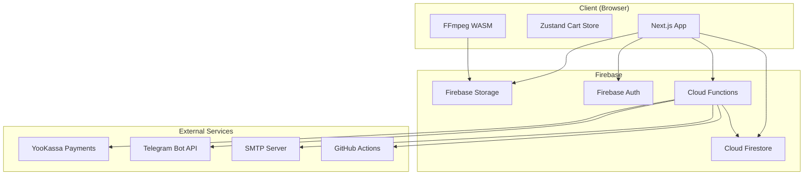
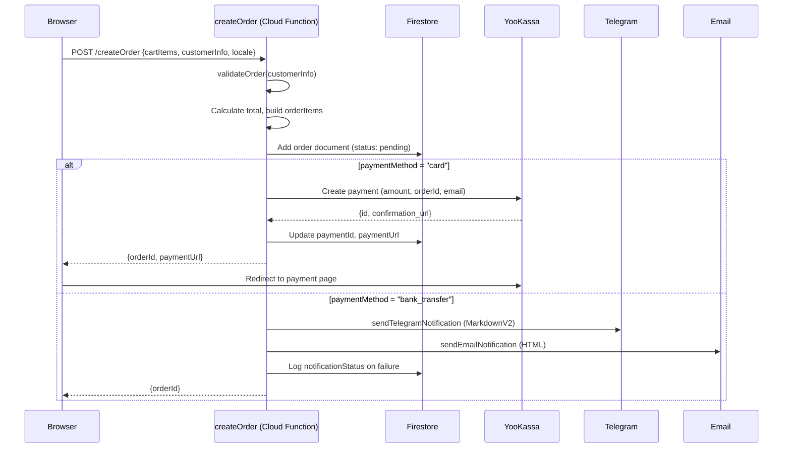
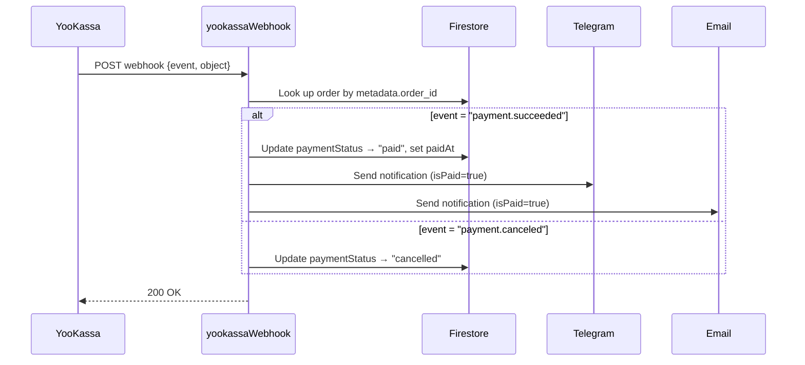
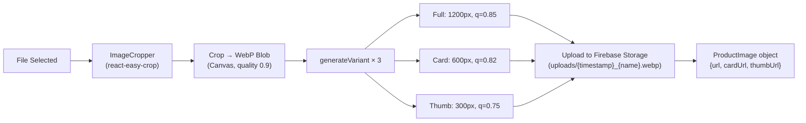
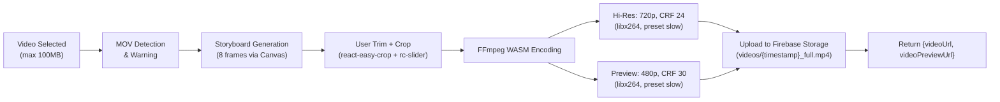
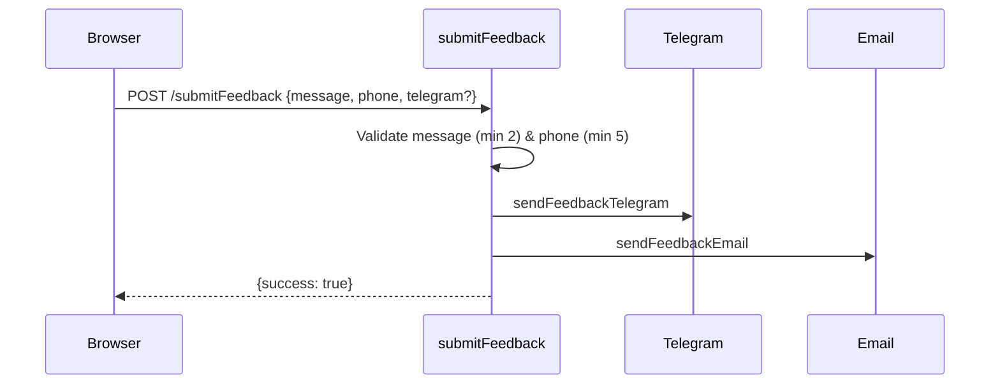

# Somanatha Shop — Technical Specification

> **Scope:** Backend logic, database schemas, data validation, media processing, event handling, and external integrations.  
> **Out of scope:** UI/UX design, CSS, layout, static content.

---

## 1. Architecture Overview

| Layer | Technology | Notes |
|---|---|---|
| Frontend | Next.js 14 (static export) | Deployed to Firebase Hosting |
| Backend API | Firebase Cloud Functions (Node 22) | `functions/index.js` — 4 endpoints |
| Database | Cloud Firestore | 7 collections |
| Storage | Firebase Storage | Images (`uploads/`) and Videos (`videos/`) |
| Auth | Firebase Auth (email/password) | Admin-only, protects write operations |
| Payments | YooKassa | Card payments via redirect flow |
| Notifications | Telegram Bot API + SMTP (Nodemailer) | Both channels fire on order events |
| CI/CD | GitHub Actions | `deploy.yml` — push-to-main + admin-triggered |



---

## 2. Database Schema (Cloud Firestore)

### 2.1 Collection: `products`

| Field | Type | Required | Constraints |
|---|---|---|---|
| `id` | `string` | Auto (doc ID) | Firestore-generated |
| `slug` | `string` | Yes | Auto-generated from `title.ru` via Cyrillic transliteration + unique suffix |
| `title` | `{ en: string; ru: string }` | Yes | Bilingual |
| `shortDescription` | `{ en: string; ru: string }` | No | Bilingual |
| `description` | `{ en: string; ru: string }` | Yes | Markdown content |
| `basePrice` | `number` | Yes | In RUB, no decimals enforced |
| `images` | `Array<string \| ProductImage>` | Yes | Mixed legacy strings + structured objects |
| `videoPreviewUrl` | `string` | No | 480p compressed MP4 |
| `videoUrl` | `string` | No | 720p high-quality MP4 |
| `category` | `string` | No | One of: `'yantras'`, `'kavacha'` |
| `subcategory` | `string` | No | References `subcategories` collection |
| `tags` | `string[]` | No | Free-form strings |
| `variations` | `VariationGroup[]` | No | Custom product-level variations |
| `variationOverrides` | `VariationOverrides` | No | `{ useDefaults: boolean, disabledOptions?: string[] }` |
| `createdAt` | `number` | Auto | `Date.now()` timestamp |
| `order` | `number` | No | Manual sort order |

#### ProductImage sub-type

| Field | Type | Notes |
|---|---|---|
| `url` | `string` | Full-res (1200px) — always present |
| `cardUrl` | `string?` | 600px medium variant |
| `thumbUrl` | `string?` | 300px thumbnail variant |
| `alt` | `{ en: string; ru: string }` | SEO alt text |
| `keywords` | `string[]?` | SEO keywords |

> [!IMPORTANT]
> The `images` array supports **both** legacy `string` URLs and structured `ProductImage` objects. The helper `normalizeImages()` in [product.ts](file:///d:/somanatha-shop/src/types/product.ts) handles backward compatibility.

---

### 2.2 Collection: `orders`

| Field | Type | Required | Constraints |
|---|---|---|---|
| `id` | `string` | Auto (doc ID) | Firestore-generated |
| `customerName` | `string` | Yes | Min 2, Max 100 chars |
| `email` | `string` | Yes | Valid email format |
| `phone` | `string` | Yes | Russian phone regex: `+7/8` + 10 digits |
| `address` | `string` | Yes | Min 10, Max 500 chars |
| `telegram` | `string?` | No | Legacy field, kept for backward compat |
| `contactPreferences` | `ContactPreferences?` | No | New multi-method contact system |
| `items` | `OrderItem[]` | Yes | See sub-type below |
| `total` | `number` | Yes | Server-calculated sum in RUB |
| `status` | `enum` | Yes | `'pending' \| 'completed' \| 'cancelled' \| 'archived'` |
| `paymentMethod` | `enum?` | Yes | `'card' \| 'bank_transfer'` |
| `paymentStatus` | `enum?` | Auto | `'pending' \| 'paid' \| 'failed' \| 'cancelled' \| 'awaiting_transfer'` |
| `paymentId` | `string?` | Auto | YooKassa payment ID |
| `paymentUrl` | `string?` | Auto | YooKassa redirect URL |
| `paidAt` | `number?` | Auto | Server timestamp on payment confirmation |
| `notes` | `string?` | No | Manager notes (admin) |
| `customerNotes` | `string?` | No | Max 1000 chars |
| `attachments` | `string[]?` | No | Uploaded image URLs |
| `notificationStatus` | `object?` | Auto | `{ telegramError?: string, emailError?: string }` |
| `createdAt` | `number` | Auto | `Date.now()` |

#### OrderItem sub-type

| Field | Type | Notes |
|---|---|---|
| `productId` | `string` | References `products` collection |
| `productTitle` | `string` | **Snapshot** — Russian title at order time |
| `quantity` | `number` | Min 1 |
| `price` | `number` | Calculated price including variation modifiers |
| `configuration` | `Record<string, string>?` | Key-value option selections |
| `selectedVariations` | `SelectedVariation[]?` | Denormalized variation choices |

#### ContactPreferences sub-type

| Field | Type | Notes |
|---|---|---|
| `methods` | `ContactMethod[]` | At least 1 required. Values: `'telegram' \| 'max' \| 'phone_call' \| 'sms' \| 'email'` |
| `telegramHandle` | `string?` | Required if `methods` includes `'telegram'`. Must start with `@` |
| `maxId` | `string?` | Required if `methods` includes `'max'` |

> [!WARNING]
> **Data Sync Risk — `productTitle` in OrderItem:** The Cloud Function serializes the product title as `item.productTitle.ru || item.productTitle` (line 312 of [index.js](file:///d:/somanatha-shop/functions/index.js)). The cart store holds `productTitle` as `{ en: string; ru: string }`, but the order flattens it to a plain `string`. If the cart sends an unexpected shape, the title becomes `[object Object]`.

---

### 2.3 Collection: `settings` (single document `general`)

| Field | Type | Default |
|---|---|---|
| `shipping.price` | `number` | `350` (RUB) |
| `shipping.freeThreshold` | `number` | `3000` (RUB) |
| `shipping.enabled` | `boolean` | `true` |
| `contact.email` | `string` | `'support@somanatha.com'` |
| `contact.phone` | `string` | `'+66 12 345 6789'` |
| `contact.telegram` | `string` | `''` |
| `contact.whatsapp` | `string` | `''` |
| `contact.instagram` | `string` | `''` |
| `contact.address` | `string` | Multi-line address string |
| `contact.telegramLink` | `string` | Full Telegram URL |
| `contact.maxLink` | `string` | Full Max messenger URL |
| `notifications.telegramEnabled` | `boolean` | `true` |
| `notifications.emailEnabled` | `boolean` | `true` |
| `notifications.templates.orderConfirmation` | `NotificationTemplate` | Subject + body with `{id}` placeholder |
| `notifications.templates.shippingUpdate` | `NotificationTemplate` | Subject + body with `{id}`, `{tracking}` placeholders |

Settings are read via [settings-service.ts](file:///d:/somanatha-shop/src/lib/settings-service.ts) and cached client-side in [useStoreSettings.ts](file:///d:/somanatha-shop/src/hooks/useStoreSettings.ts) using a module-level singleton pattern.

---

### 2.4 Collection: `categoryVariations`

Document ID = category slug (e.g., `yantras`, `kavacha`).

| Field | Type |
|---|---|
| `categorySlug` | `string` |
| `variations` | `VariationGroup[]` — array of `{ id, name: {en,ru}, options: VariationOption[] }` |
| `updatedAt` | `number` |

Each `VariationOption` carries `{ id, label: {en,ru}, description?: {en,ru}, priceModifier: number }`.

---

### 2.5 Collection: `subcategories`

| Field | Type |
|---|---|
| `id` | `string` (auto) |
| `slug` | `string` |
| `title` | `{ en: string; ru: string }` |
| `parentCategory` | `CategorySlug` |

---

### 2.6 Collection: `reviews`

| Field | Type |
|---|---|
| `id` | `string` (auto) |
| `author` | `string` |
| `content` | `string` |
| `rating` | `number` |
| `sourceUrl` | `string?` |
| `createdAt` | `any` (Firestore Timestamp) |

---

### 2.7 Security Rules Summary

| Collection | Read | Create | Update/Delete |
|---|---|---|---|
| `products` | Public | Auth required | Auth required |
| `orders` | Public | **Public** (anyone can create) | Auth required |
| `options` | Public | Auth required | Auth required |
| `categoryVariations` | Public | Auth required | Auth required |
| `subcategories` | Public | Auth required | Auth required |
| `reviews` | Public | Auth required | Auth required |

> [!CAUTION]
> Orders have **public read** access (needed for the payment status page). There is no document-level restriction — any authenticated user (not just admins) can modify any order. No role-based access control exists.

---

## 3. Data Validation — Checkout Schema

Validation is handled by [checkout-schema.ts](file:///d:/somanatha-shop/src/lib/checkout-schema.ts) (Zod, client-side) and [validateOrder()](file:///d:/somanatha-shop/functions/index.js#L32-L39) (server-side, Cloud Function).

### Character Limits & Validation Rules

| Field | Client (Zod) | Server (CF) | ⚠️ Mismatch |
|---|---|---|---|
| `customerName` | min 2, max **100** | min 2 only | **No max enforced server-side** |
| `email` | `.email()` | `includes('@')` | Server validation is weaker |
| `phone` | Regex for Russian format | truthy check only | Server accepts any non-empty string |
| `address` | min **10**, max **500** | min 10 only | **No max enforced server-side** |
| `customerNotes` | max **1000** | Not validated | **Not validated server-side** |
| `paymentMethod` | `enum['card','bank_transfer']` | `includes()` check | Equivalent |
| `contactPreferences.methods` | min 1, enum set | Not validated | **Not validated server-side** |
| `telegramHandle` | Must start with `@` | Not validated | **Not validated server-side** |

> [!WARNING]
> **Critical gap:** The server-side `validateOrder()` function performs minimal validation. All Zod constraints (max lengths, regex patterns, contact preference rules) exist **only on the client**. A direct API call bypassing the frontend would allow oversized or malformed data into Firestore.

---

## 4. Order Processing Pipeline

### 4.1 Order Creation Flow



### 4.2 Payment Webhook Flow (YooKassa)



### 4.3 Order ID Format

- **Firestore document ID:** Full auto-generated string (e.g., `ABcDeFgHiJkLmNoPqRsT`)
- **Display format:** Last 8 characters, uppercased: `#QRSTUVWX`
- **YooKassa description:** Truncated to **128 characters** — `Заказ #XXXXXXXX: item1 x1, item2 x2...`

---

## 5. Cart & Pricing Logic

Managed by [cart-store.ts](file:///d:/somanatha-shop/src/store/cart-store.ts) (Zustand + localStorage persistence).

| Feature | Logic |
|---|---|
| **Item deduplication** | Same `productId` + same `configuration` (JSON-stringified) → increment quantity |
| **Cart item ID** | Random 7-char base36 string |
| **Free shipping** | `totalPrice >= _shippingFreeThreshold` (default: 3000₽) |
| **Gift discount** | Every 11th item is free (cheapest item discounted) |
| **Discount calculation** | Flatten all items to individual units → sort by price ASC → discount the N cheapest, where N = `floor(totalItems / 11)` |
| **Final price** | `subtotal - discount + shippingCost` (floored at 0) |
| **Shipping config sync** | `setShippingConfig()` called from settings hook to sync with Firestore values |

> [!NOTE]
> The total sent to the Cloud Function is **recalculated server-side** from `cartItems.reduce(sum + item.price * item.quantity)`. However, the gift discount is **not applied server-side** — the total may differ from what the cart UI shows.

---

## 6. Media Processing Pipelines

### 6.1 Image Upload Pipeline (Admin Panel)

Source: [ImageUpload.tsx](file:///d:/somanatha-shop/src/components/admin/ImageUpload.tsx)



| Variant | Max Dimension | Quality | Storage Suffix | Usage |
|---|---|---|---|---|
| Full | 1200px | 0.85 | `{name}.webp` | Product detail page |
| Card | 600px | 0.82 | `{name}_card.webp` | Product listing cards |
| Thumb | 300px | 0.75 | `{name}_thumb.webp` | Cart, thumbnails |

**Processing:** Entirely client-side using HTML Canvas `drawImage` + `toBlob('image/webp')`. All 3 variants generated in parallel, then uploaded in parallel.

**Cache headers:** `public, max-age=31536000, immutable` (1 year).

---

### 6.2 Video Upload Pipeline (Admin Panel)

Source: [VideoUpload.tsx](file:///d:/somanatha-shop/src/components/admin/VideoUpload.tsx)



| Variant | Resolution | CRF | Codec | Audio | Usage |
|---|---|---|---|---|---|
| Hi-Res | 720p max | 24 | H.264 (libx264) | Stripped | Product detail page |
| Preview | 480p max | 30 | H.264 (libx264) | Stripped | Product cards (Live Photo) |

**Key details:**
- FFmpeg WASM loaded from `unpkg.com/@ffmpeg/core@0.12.6`
- `+faststart` flag for streaming-optimized MP4
- Spatial cropping via FFmpeg `crop` filter (from react-easy-crop pixel coordinates)
- Temporal trimming via `-ss` and `-t` flags
- MOV/QuickTime files auto-converted to MP4

---

### 6.3 Batch Image Migration Script

Source: [migrate-images.js](file:///d:/somanatha-shop/scripts/migrate-images.js)

Server-side Node.js script using `sharp` for batch processing existing products:

| Step | Details |
|---|---|
| Download | Fetch original image from Firebase Storage URL |
| Resize | `sharp.resize(maxDim, { fit: 'inside', withoutEnlargement: true })` |
| Convert | `.webp({ quality })` |
| Upload | Firebase Admin SDK → `bucket.file().save()` with download tokens |
| Update | Firestore `products/{id}.images[]` updated with `cardUrl`/`thumbUrl` |

Variants: `_card` (600px, q=82) and `_thumb` (300px, q=75). Supports `--dry-run` and `--product-id` flags.

---

## 7. Event Flows & Notifications

### 7.1 Notification Channels

| Channel | Config (env vars) | Format | Error Handling |
|---|---|---|---|
| **Telegram Bot** | `TELEGRAM_BOT_TOKEN`, `TELEGRAM_CHAT_ID` | MarkdownV2 | Logged to `order.notificationStatus.telegramError` |
| **SMTP Email** | `SMTP_HOST`, `SMTP_PORT`, `SMTP_USER`, `SMTP_PASS`, `EMAIL_FROM`, `EMAIL_TO` | HTML | Logged to `order.notificationStatus.emailError` |

### 7.2 Event → Notification Matrix

| Event | Trigger | Telegram | Email | Notes |
|---|---|---|---|---|
| **Bank transfer order** | `createOrder` CF, `paymentMethod = 'bank_transfer'` | ✅ | ✅ | `Promise.allSettled` — failures logged, order still created |
| **Card payment success** | `yookassaWebhook`, `payment.succeeded` | ✅ | ✅ | `Promise.all` — if one fails, the other may still succeed but errors aren't logged to Firestore |
| **Card payment cancel** | `yookassaWebhook`, `payment.canceled` | ❌ | ❌ | Only updates Firestore status |
| **Contact form** | `submitFeedback` CF | ✅ | ✅ | `Promise.all` — no error logging to Firestore |

> [!WARNING]
> **Inconsistency:** Bank transfer orders use `Promise.allSettled` with error logging to Firestore. Card payment webhook uses `Promise.all` **without** error logging. A Telegram failure on card payment will silently fail and not be recorded on the order document.

### 7.3 Telegram Message Structure (Order)

```
🛒 *Новый заказ\!*
📋 *Заказ \#ABCD1234*
👤 *Клиент:* Name
📧 *Email:* email@example.com
📱 *Телефон:* +7 999 123 4567
📍 *Адрес:* Address text
📝 *Комментарий:* (if present)
📞 *Способы связи:*
  • 💬 Telegram: @handle
  • 📲 MAX: id
📦 *Товары:*
  • Product x1 — 1000₽
💰 *Итого:* 1000₽
💳 Банковская карта / 🏦 Перевод по реквизитам
✅ Оплачен / ⏳ Ожидает подтверждения менеджером
```

All user-supplied text is escaped via `escapeMarkdown()` for MarkdownV2 safety.

### 7.4 Contact Form (Feedback) Flow



---

## 8. Customer Profile Aggregation

Source: [customer-service.ts](file:///d:/somanatha-shop/src/lib/customer-service.ts)

Customers are **not stored in Firestore** — they are derived in real-time by iterating over all orders and matching on:

1. **Email** (case-insensitive)
2. **Phone** (exact match)
3. **Telegram handle** (case-insensitive, `@` stripped)

| Scenario | Behavior |
|---|---|
| No profile matches | Create new `Customer` with `id = email || phone || random` |
| One profile matches | Update stats (`totalSpent`, `orderCount`, dates), merge missing contact info |
| Multiple profiles match | **Merge** all matching profiles into the first, aggregate stats |

> [!NOTE]
> This is an `O(n²)` algorithm over all orders — acceptable for small order volumes but will degrade as orders grow. The customer ID is not stable (depends on matching heuristics) and can change if a customer adds a new contact method.

---

## 9. Deployment Pipeline (CI/CD)

Source: [deploy.yml](file:///d:/somanatha-shop/.github/workflows/deploy.yml)

### Triggers

| Trigger | Event |
|---|---|
| Push to `main` | Automatic |
| Admin panel button | `triggerDeploy` Cloud Function → GitHub `repository_dispatch` event |

### Pipeline Steps

1. Checkout code
2. Setup Node.js 22
3. `npm ci` (install dependencies)
4. Write `.env.local` from GitHub Secrets (13 environment variables)
5. Write Firebase service account JSON from `FIREBASE_SERVICE_ACCOUNT` secret
6. `npm run build` (static export with `GOOGLE_APPLICATION_CREDENTIALS`)
7. Deploy to Firebase Hosting (`out/` directory)
8. Deploy Cloud Functions (separate `npm ci` in `functions/`, **continue-on-error: true**)
9. Clean up credentials

The `triggerDeploy` Cloud Function requires Firebase Auth and a `GITHUB_PAT` secret.

---

## 10. Data Synchronization Risks

### 10.1 String Handling Across Layers

| Data Point | Frontend (Cart/Checkout) | Cloud Function | Firestore | Risk |
|---|---|---|---|---|
| `productTitle` | `{ en: string; ru: string }` (CartItem) | Flattened to `item.productTitle.ru \|\| item.productTitle` | Stored as `string` | If cart sends object, title becomes `[object Object]` |
| `customerName` | Max 100 (Zod) | Min 2 only | No field-level schema | Oversized names accepted via direct API |
| `address` | Max 500 (Zod) | Min 10 only | No limit | Oversized addresses accepted via direct API |
| `notes` | Max 1000 (Zod) | Not validated | No limit | Unlimited notes via direct API |
| `createdAt` | `Date.now()` (client) | `Date.now()` (CF) | `number` | Consistent, but webhook uses `serverTimestamp()` for `paidAt` (different type) |
| `orderId` display | `id.slice(-8).toUpperCase()` | Same | Full ID stored | ✅ Consistent |

### 10.2 Identified Gaps

| # | Issue | Severity | Location |
|---|---|---|---|
| 1 | No server-side max-length validation | **Medium** | [index.js:32-39](file:///d:/somanatha-shop/functions/index.js#L32-L39) |
| 2 | `contactPreferences` not validated server-side | **Medium** | [index.js:32-39](file:///d:/somanatha-shop/functions/index.js#L32-L39) |
| 3 | Gift discount not applied server-side (total mismatch risk) | **High** | [index.js:308](file:///d:/somanatha-shop/functions/index.js#L308) |
| 4 | Webhook notification errors not logged to Firestore (card payments) | **Medium** | [index.js:459-462](file:///d:/somanatha-shop/functions/index.js#L459-L462) |
| 5 | `paidAt` uses `serverTimestamp()` while `createdAt` uses `Date.now()` | **Low** | [index.js:455](file:///d:/somanatha-shop/functions/index.js#L455) |
| 6 | No RBAC — any authenticated user can write to any collection | **Medium** | [firestore.rules](file:///d:/somanatha-shop/firestore.rules) |
| 7 | Customer profiles are volatile (recalculated from orders every time) | **Low** | [customer-service.ts](file:///d:/somanatha-shop/src/lib/customer-service.ts) |

---

## 11. Environment Variables Reference

### Root `.env.local` (Next.js)

| Variable | Used By |
|---|---|
| `NEXT_PUBLIC_FIREBASE_API_KEY` | Firebase client SDK |
| `NEXT_PUBLIC_FIREBASE_AUTH_DOMAIN` | Firebase Auth |
| `NEXT_PUBLIC_FIREBASE_PROJECT_ID` | Firebase client + admin |
| `NEXT_PUBLIC_FIREBASE_STORAGE_BUCKET` | Firebase Storage |
| `NEXT_PUBLIC_FIREBASE_MESSAGING_SENDER_ID` | Firebase Messaging |
| `NEXT_PUBLIC_FIREBASE_APP_ID` | Firebase Analytics |
| `NEXT_PUBLIC_API_BASE_URL` | Cloud Functions base URL (fallback: `us-central1-somanatha-shop.cloudfunctions.net`) |

### Cloud Functions (`functions/.env`)

| Variable | Used By |
|---|---|
| `SMTP_HOST`, `SMTP_PORT`, `SMTP_USER`, `SMTP_PASS` | Nodemailer (email notifications) |
| `EMAIL_FROM`, `EMAIL_TO` | Email sender/recipient |
| `TELEGRAM_BOT_TOKEN`, `TELEGRAM_CHAT_ID` | Telegram Bot API |
| `YOOKASSA_SHOP_ID`, `YOOKASSA_SECRET_KEY` | YooKassa payment gateway |
| `GITHUB_PAT` | GitHub Actions dispatch (secret, set via `firebase functions:secrets:set`) |

### CI/CD (GitHub Secrets)

All of the above plus `FIREBASE_SERVICE_ACCOUNT` (base64-encoded service account JSON).
